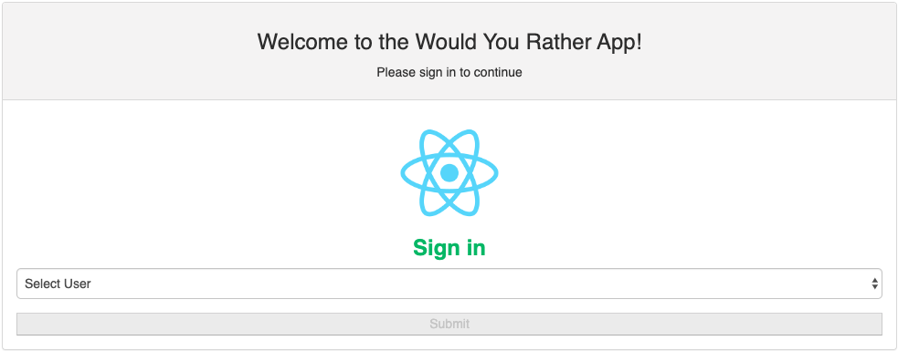
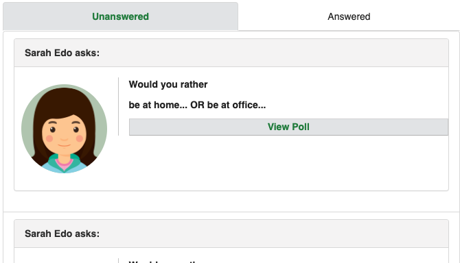
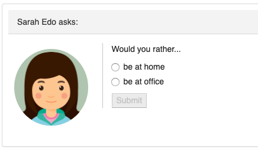
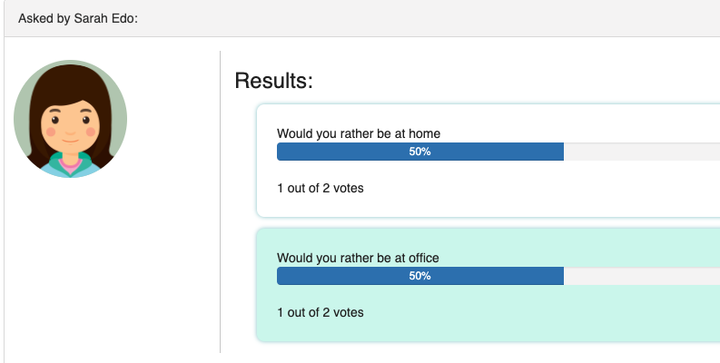
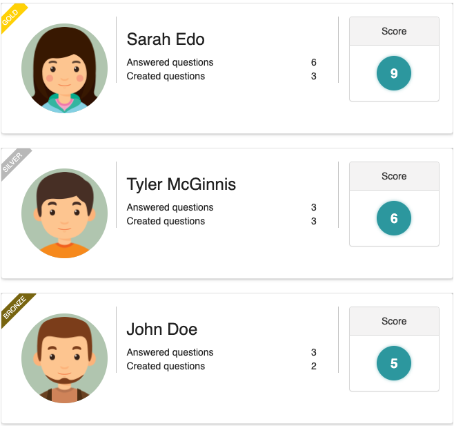
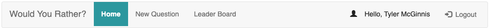

# Would You Rather App
In this web app will lets a user to play the “Would You Rather?” game. The game goes like this: A user is asked a question in the form: “Would you rather [option A] or [option B] ?”. Answering "neither" or "both" is against the rules.

In this app, users will be able to answer questions, see which questions they haven’t answered, see how other people have voted, post questions, and see the ranking of users on the leaderboard.

## Quick start

To run the application:

* clone the project from the git location `https://github.com/vijithaepa/would-you-rather.git`
* navigate in to the folder and install all project dependencies with `npm install`
* start the development server with `npm start` or `yarn start`
* start a browser and type the url `http://localhost:3000/`
* Functionality is detailed in the `PROJECT.md` file, under `App Functionality`

## App Functionality
* User will be redirect to login page at first or whenever user try to access a page without login first: 

* Once user is logged in, will be direct to home page where user can see the both Unanswered and Answered questions. But the Unanswered tab will be selected as default.

* When the user click on the "View Poll" button, will be taken to answer the poll (if it's unanswered)

* If the question is already answered, then will be taken to result page.

* User can navigate to the LeaderBoard to see the leading scores so far.

* Navigation bar is always appear on the top of the page, where user can navigate through the pages.

##Avatar images are taken from : 
Icons made by [Freepik](https://www.flaticon.com/authors/freepik) from [www.flaticon.com](https://www.flaticon.com/)
